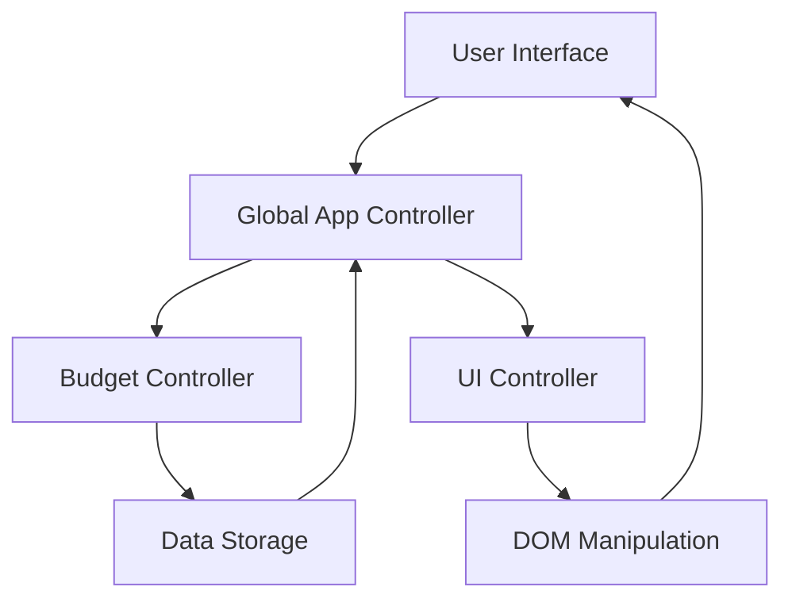

# Styled Budgety Calculator

A clean, modern budget calculator web application for tracking income and expenses with real-time calculations and an intuitive user interface.

Built in June 2018. This pure JavaScript ES6 application provides a simple way to manage personal finances by tracking income, expenses, and calculating available budget with percentage breakdowns.

## Features

- 💰 Add income and expense items with descriptions
- 📊 Real-time budget calculation (income - expenses)
- 📈 Automatic percentage calculation for each expense
- 🎨 Color-coded interface (green for income, red for expenses)
- 🗑️ Delete items with hover interaction
- 📅 Display current month and year
- ✨ Smooth animations and transitions
- 💵 Automatic number formatting with commas and decimals
- 📱 Responsive design

## Getting Started

### Prerequisites

- A modern web browser (Chrome, Firefox, Safari, or Edge)
- JavaScript enabled

### Installation

1. Clone the repository:
```bash
git clone https://github.com/orassayag/styled-budgety-calculator.git
cd styled-budgety-calculator
```

2. Open `index.html` in your web browser:
```bash
# Simply double-click the file or use a local server:
python -m http.server 8000
# Then navigate to http://localhost:8000
```

That's it! No build process or dependencies required.

### Usage

1. **Select transaction type**: Choose `+` for income or `-` for expense
2. **Enter description**: Add a description for the transaction
3. **Enter amount**: Input the transaction value
4. **Submit**: Click the checkmark button or press Enter
5. **View results**: See your budget update automatically
6. **Delete items**: Hover over any item and click the × button

## Project Structure

```
styled-budgety-calculator/
├── index.html          # Main HTML structure
├── style.css           # All styles and animations
├── app.js              # Application logic
├── README.md           # This file
├── CONTRIBUTING.md     # Contribution guidelines
├── INSTRUCTIONS.md     # Detailed usage instructions
└── LICENSE             # MIT license
```

## Architecture

The application follows the **Module Pattern** with separation of concerns:



### Module Breakdown

**Budget Controller**:
- Manages data structure for income and expenses
- Calculates totals and percentages
- Handles add/delete operations

**UI Controller**:
- Gets input from form fields
- Displays budget information
- Renders income/expense lists
- Manages DOM updates

**Global App Controller**:
- Coordinates between modules
- Handles event listeners
- Orchestrates data flow

## Built With

* [JavaScript ES6](https://javascript.info) - Pure vanilla JavaScript with no frameworks
* [HTML5](https://learn.shayhowe.com/html-css) - Semantic markup
* [CSS3](https://learn.shayhowe.com/html-css) - Modern styling with animations
* [Google Fonts](https://fonts.google.com) - Open Sans font family
* [Ionicons](http://ionicons.com) - Icon library

## Code Example

```javascript
// Adding a new income item
budgetController.additem('inc', 'Salary', 5000);

// Calculating the budget
budgetController.calculateBudget();
const budget = budgetController.getBudget();
// Returns: { budget: 5000, totalInc: 5000, totalExp: 0, percentage: -1 }
```

## Browser Support

| Browser | Version |
|---------|---------|
| Chrome  | ✅ Latest 2 versions |
| Firefox | ✅ Latest 2 versions |
| Safari  | ✅ Latest 2 versions |
| Edge    | ✅ Latest 2 versions |

## Development

### Code Style

- ES6 JavaScript features (arrow functions, const/let, template literals)
- Module Pattern for encapsulation
- IIFE (Immediately Invoked Function Expressions)
- Prototype-based inheritance for data objects

### Testing

Open the browser console and test the exposed methods:
```javascript
// Test data structure
budgetController.testing();

// Check DOM strings
UIController.getDOMstrings();
```

## Contributing

Contributions to this project are [released](https://help.github.com/articles/github-terms-of-service/#6-contributions-under-repository-license) to the public under the [project's open source license](LICENSE).

Everyone is welcome to contribute. Contributing doesn't just mean submitting pull requests—there are many different ways to get involved, including answering questions and reporting issues.

Please feel free to contact me with any question, comment, pull-request, issue, or any other thing you have in mind.

See [CONTRIBUTING.md](CONTRIBUTING.md) for detailed contribution guidelines.

## Author

* **Or Assayag** - *Initial work* - [orassayag](https://github.com/orassayag)
* Or Assayag <orassayag@gmail.com>
* GitHub: https://github.com/orassayag
* StackOverflow: https://stackoverflow.com/users/4442606/or-assayag?tab=profile
* LinkedIn: https://linkedin.com/in/orassayag

## License

This application has an MIT license - see the [LICENSE](LICENSE) file for details.

## Acknowledgments

- Built as part of learning modern JavaScript patterns
- Inspired by personal finance management needs
- Design focused on simplicity and usability
